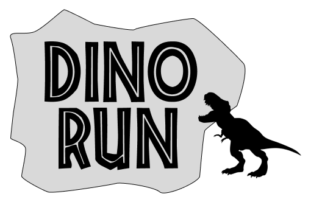
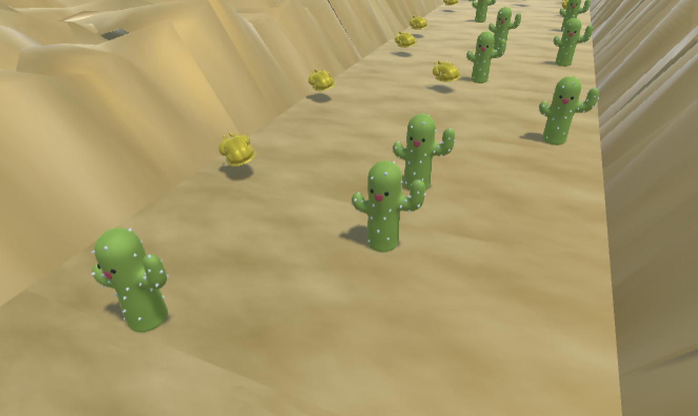
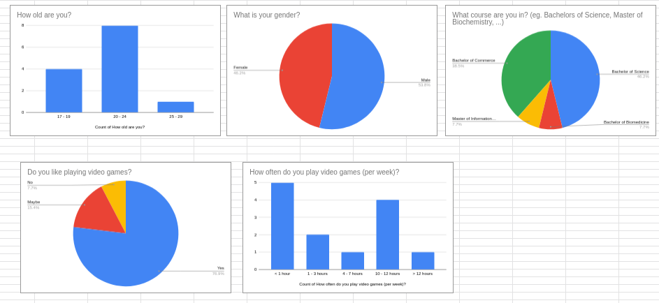

**The University of Melbourne**
# COMP30019 – Graphics and Interaction

## Teamwork plan/summary

<!-- [[StartTeamworkPlan]] PLEASE LEAVE THIS LINE UNTOUCHED -->

<!-- Fill this section by Milestone 1 (see specification for details) -->

* The group will meet weekly on Tuesdays.
* We will use Discord to communicate and Trello for project/task management and delegation.
* Git workflow
  * Every feature will have it's own branch and will be named appropriately
  * Every feature should be code reviewed (ie. pull requests should be approved by at least 1 other member before merging)
* Communicate with the team if tasks cannot be completed on time.
* Delegation
  * Xin Yu: 3D Models and Shaders
  * Aurelia: Animation and UI
  * Bowen: Procedural Generation and Footstep Particles
  * Daniel: Procedural Generation

<!-- [[EndTeamworkPlan]] PLEASE LEAVE THIS LINE UNTOUCHED -->

## Final report

Read the specification for details on what needs to be covered in this report... 

Remember that _"this document"_ should be `well written` and formatted **appropriately**. 
Below are examples of markdown features available on GitHub that might be useful in your report. 
For more details you can find a guide [here](https://docs.github.com/en/github/writing-on-github).

### Table of contents
- [COMP30019 – Graphics and Interaction](#comp30019--graphics-and-interaction)
  - [Teamwork plan/summary](#teamwork-plansummary)
  - [Final report](#final-report)
    - [Table of contents](#table-of-contents)
    - [Technologies](#technologies)
    - [Game Summary](#game-summary)
    - [How to Play](#how-to-play)
    - [High Level Gameplay Decisions](#high-level-gameplay-decisions)
    - [How We Designed Objects, Entities, Textures and Other Graphical Assets](#how-we-designed-objects-entities-textures-and-other-graphical-assets)
    - [Custom HLSL Shader 1 Report: Lava Shader](#custom-hlsl-shader-1-report-lava-shader)
    - [Custom HLSL Shader 2 Report: Water Shader](#custom-hlsl-shader-2-report-water-shader)
    - [Procedural Generation](#procedural-generation)
    - [Particle System Report](#particle-system-report)
    - [Evaluation (Querying and Observational Methods) Report](#evaluation-querying-and-observational-methods-report)
    - [References](#references)

---
### Technologies
Project is created with:
* Unity 2022.1.9f1 
* Blender

---
### Game Summary

[_🦖 Dino Run_ ](https://youtu.be/4xz4iq8mCRk) is an endless runner game where you are a dinosaur running from lava. Avoid obstacles that slow you down, eat food to increase your speed and collect power-ups as you go. Compete with your friends to get the highest score!

---
### How to Play

---
### High Level Gameplay Decisions
* 
* We had to decide between either creating multiple maps that the player would be able to choose 
* We had initially also had the idea of adding powerups but then realised that the game was already very fast-paced and the player already had a pretty clear objective that took most of their focus. As such, we decided not to clutter the screen with too many assets and features and decided to keep the game as simple and minimalistic possible.

---
### How We Designed Objects, Entities, Textures and Other Graphical Assets

---
### [Custom HLSL Shader 1 Report: Lava Shader](./reports/lava-shader/lava-shader.md)

---
### [Custom HLSL Shader 2 Report: Water Shader](./reports/water-shader/water-shader.md)

---
### [Procedural Generation](./reports/procedural-generation/procedural-generation.md)
[_](./reports/procedural-generation/procedural-generation.md)

---
### Particle System Report

---
### [Evaluation (Querying and Observational Methods) Report](./reports/evaluation/evaluation-report.md)

---
### References
* For Shaders: https://catlikecoding.com/unity/tutorials/rendering/part-2/