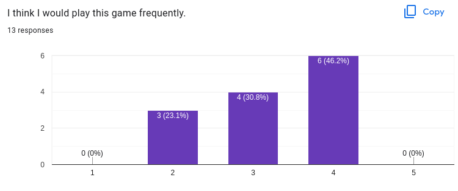

<h1 align="center">Evaluation Report</h1>

> [🏠 README.md](../../README.md) | [⬅️ Particle System Report]() | [⬅️ Lava Shader Report](../lava-shader/lava-shader.md)

## Table of Contents
- [Observational Method](#observational-method)
  - [Methodology](#methodology)
  - [6. Thank the player for their time](#6-thank-the-player-for-their-time)
  - [Results](#results)
    - [Observational Session Notes](#observational-session-notes)
      - [Participant 1](#participant-1)
        - [Likes](#likes)
        - [Improvements](#improvements)
      - [Participant 2](#participant-2)
        - [Likes](#likes-1)
        - [Improvements](#improvements-1)
      - [Participant 3](#participant-3)
        - [Likes](#likes-2)
        - [Improvements](#improvements-2)
      - [Participant 4](#participant-4)
        - [Likes](#likes-3)
        - [Improvements](#improvements-3)
      - [Paticipant 5](#paticipant-5)
        - [Likes](#likes-4)
        - [Improvements](#improvements-4)
    - [Other Observations Found](#other-observations-found)
- [Query Technique](#query-technique)
    - [Demographic](#demographic)
    - [Responses](#responses)
    - [Conclusion](#conclusion)
- [Improvements Made Based on the Findings](#improvements-made-based-on-the-findings)

# Observational Method
## Methodology
Amongst the 3 types of observational methods we've learnt (Think Aloud, Cooperative Evaluation and Post-task walkthroughs), we chose to perform Post-task walkthroughs. This is donw by initially observing the participants then discussing with them afterwards about specific things that they had done or how they felt overall about the game. We decided on this technique as it made playing a bit more natural to player and didn't want to interrupt them while they played. We also told them that they could note down any thoughts they might want to talk about so they wouldn't forget about them when we started the discussions.

The flow of each observational session was as follows:
1. Explained to the player they would be playing a game for 5 minutes
2. Set the timer for 5 minutes, player starts playing
3. Once the 5 minutes are up, the player stops playing and we start discussions
4. Prompting questions asked during the discussion: "What did you think about the game overall and why?", "What did you like about the game?", "What do you think we can improve on?"
5. Player filled out the query form as well to get data about their demographic and user experience
6. Thank the player for their time
---
## Results
We carried out 5 Observational Sessions on a demographic of 3 females and 2 males between the ages of 17-29. The participant's gameplay during the 5 minute observational period as well as their discussions were recorded on video and captured in notes below.

### Observational Session Notes
#### Participant 1
> * Age: 20-24yo
> * Gender: Female
> * Course: Bachelor of Science
> * Like Video Games?: Maybe
> * Hours of Video Games per week: < 1 hour

##### Likes
* Felt that controls were easy, classic and simple
* Liked the cuteness of the cacti

##### Improvements
* Felt that procedural generation was too random
  * think that it should depend on the level (ie. there should be more cacti as the levels get higher)
* Felt that there were too many cacti in the beginning
* Didn't like the glitchy environment (occured when the speed was at the max)
* Would like to see more player animation; for example, player should be startled when hitting a cactus

#### Participant 2
> * Age: 20-24yo
> * Gender: Female
> * Course: Bachelor of Science
> * Like Video Games?: Yes
> * Hours of Video Games per week: 4-7 hours

##### Likes
* Effects of perticles when player hits obstacles
* Running animation
* 3D Models: Chicken, Cactus Model
* Speed at grass level (level3)

##### Improvements
* Couldn't really see the chicken in the desert level (level1); suggested increasing the contrast or changing the colour of the chicken for that level
* Initial speed was too slow and dodge speed was too slow
* Material of the grass was too plain; suggested adding texture
* Hard to read text in snow level (level2) because the text was white and the environment was white; suggested adding a box with a contrasting background colour around the distance and level UI

#### Participant 3
> * Age: 25-29yo
> * Gender: Male
> * Course: Master of Information Technology
> * Like Video Games?: Maybe
> * Hours of Video Games per week: < 1 hour

##### Likes
* Overall gameplay
* 3D Models

##### Improvements
* Wasn't sure about the cactus hitboxees, especially around the cactus arms
* Felt that the initial speed was too slow
* Needed to explain how to play the game
* Didn't like the glitching that happened when the player was at high speeds
* Felt like more chicken were being spawned on the left than on the right
* Not enough chicken
* Time in each level should be longer (level1 and level2 felt too quick)
* Suggested adding different player skins

#### Participant 4
> * Age: 17-19yo
> * Gender: Male
> * Course: Bachlor of Science
> * Like Video Games?: Yes
> * Hours of Video Games per week: < 1 hour

##### Likes
* Speed progression
* Good design
* Liked the different cacti materials in the different terrains

##### Improvements
* Couldn't see the level and distance text UI information; suggested using different text colours
* Noticed the side terrain texture clipping
* Suggested increasing dodge speed
* Suggested changing the colour of health bar when going below a certain threshold % (for example, green when close to full, orange when in the middle and red when close to zero)
* Commented that the cactus model looks like asparagus

#### Paticipant 5
> * Age: 20-24yo
> * Gender: Female
> * Course: Bachelor of Biomedicine
> * Like Video Games?: Yes
> * Hours of Video Games per week: < 1 hour

##### Likes
* Cute graphics
* Liked the chicken model
* Felt the game was fun

##### Improvements
* Dodge speed was too slow
* Frequency of chicken was sporadic and was frustrated that there were times where there were no chickens at all for 3-4 planes
* Felt that chicken frequency was lower at higher levels
* Found it hard to read the level and distance text UI information
* Noticed the terrain clipping
* Suggested replacing the cacti models with snowmen in the snow level (level3)

### Other Observations Found
* None of the participants managed to get to the highest level as the dodge speed was a bottleneck to being able to successfully dodge obstacles at high speeds
* Although all participants were intuitively aware that they should use the arrow buttons to control the player and that the objective was to travel the longest distance, they weren't 100% certain about the controls or objective.
* An interesting observation found was that many participants thought that chicken frequency decreased as the levels got higher. However, we did not add any additional logic for decreasing the probability of chickens appearing at higher levels. This might be a psychological effect experienced by the player as the higher speeds meant that the chickens were harder to obtain, and as such were perceived to be appearing less frequently.

---

# Query Technique
We decided to use questionaaires as our querying technique as it was easy to administer and analyse and allowed us to easily reach a lot of users as well as easily compare across them. We also based our questionnaire around the SUS 

### Demographic
We managed to get an almost even split amongst males and females, mostly between the ages of 20 to 24 (inclusive) with majority studying Bachelors of Science or Bachelors of Commerce.

Most of our particpants enjoyed video games but the number of hours spent per week varied among particpants, with most either spending less than an hour per week or 10-12 hours

### Responses

### Conclusion
We were fairly pleased with the responses as it indicated that our game was easy to play and use, and accomodated the users. 

---

# Improvements Made Based on the Findings
* ✅ Dodge speed was increased
* ✅ Added an instructions page
* ✅ Added grass level plane texture
* ✅ Changed calctulation of level thresholds which resulted in longer time being spent on lower levels