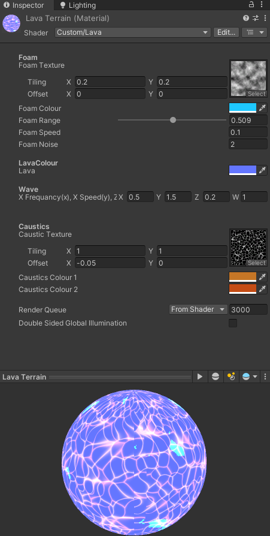
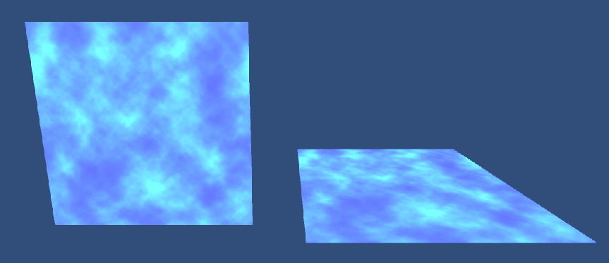

# Lava Shader
> [🏠 README.md](../../README.md) | [⬅️ Evaluation Report](../evaluation/evaluation-report.md) | [➡️ Water Shader](../water-shader/water-shader.md)


The first HLSL/CG that we would like to be marked on is the lava shader. This shader is used for the mountainous terrain of the final level of the game.

## Table of Contents
- [Lava Shader](#lava-shader)
  - [Table of Contents](#table-of-contents)
  - [Asset Files](#asset-files)
  - [Attributes](#attributes)
  - [Breakdown](#breakdown)
    - [Vertex Shader](#vertex-shader)
    - [Fragment Shader](#fragment-shader)
      - [Foam](#foam)
    - [Caustics](#caustics)
    - [Final Colour](#final-colour)

## Asset Files
> List of exact paths to repective shader asset files
* `./Assets/Shaders/Lava.shader` The shader code, written in HLSL
* `./Assets/Shaders/Noise.png` Noise texture used for the flowing 
* `./Assets/Shaders/T_Caustics03.png` Caustics texture used to give the 'lava' look (found from <TODO insert link>)
* `./Assets/Materials/Lava Terrain.mat` material that utilises the lava shader (this material is applied to the mountainous terrain of the final level of the game)

## Attributes


Multiple attributes for the foam, lava colour, wave frerquency and caustics are able to be varied.

## Breakdown
* This shader implements both the `vert()` and `frag()` functions
  * The Vertex Shader determines the position of the vertices and is useed to create the wave movement
  * The Pixel/Fragment Shader determines the colour of eaach pixel

### Vertex Shader


The wave movement was created by taking the cos and sins of the `x` and `z` and adding it to the `y` as follows:
```c
// Implementing Vertex Shader
vertOut vert( vertIn v)
{
    vertOut o;

    // Create Wave movement using cos and sin with the time
    v.vertex.y += cos(_Time.y * _WaveFrequencySpeed.y +  v.vertex.x) * _WaveFrequencySpeed.x;
    v.vertex.y += sin(_Time.y * _WaveFrequencySpeed.w +  v.vertex.z ) * _WaveFrequencySpeed.z;

    // Convert model vertices in model space to model vertices in clipping space
    o.vertex = UnityObjectToClipPos(v.vertex);

    o.uv = v.uv;
    return o;
}
```

### Fragment Shader

2 main textures were added to give the materials more interesting aesthetics:
  1. Foam: a top-layer of foam that flows over time
  2. Caustics: the patterned texture that makes the material look like it has crevices

#### Foam


The 'foam' was added to this shader to make the lava look like it is flowing and give it more movement and excitement. The code for calculating the foam colour is as follows:
```c#
// Implementing Pixel/Fragment Shader
float4 frag(vertOut v): SV_Target
{
    half foamRange = _FoamRange;
    // Make the foam move diagonally accrosss over time
    half foam_tex = tex2D(_FoamTex, v.uv + _Time.y * _FoamSpeed);
    // Enhance the contrast of the foam texture
    foam_tex = pow(foam_tex, _FoamNoise);
    // Makes the foam have hard edges  (stylistic choice)
    half4 foam_color = foamRange < foam_tex * _FoamColour;
    ...
```
A notable stylistic choice was made to make the foam colour essentially binary by checking if the foam_tex was more than the foamRange property. Without this conditional, the texture would be applied with soft edges as shown below:


### Caustics
The caustics were added to this shader because it made the lava like a stylised liquid.


```c#
float4 frag(vertOut v): SV_Target
{
    ...
    // Place two caustic textures
    half caustic1 = tex2D(_CausticTex, v.uv + _CausticTex_ST.xy).r;
    half caustic2 = tex2D(_CausticTex, v.uv + _CausticTex_ST.zw).r;
    half3 caustic_color1 = caustic1 * _CausticColour1.rgb;
    half3 caustic_color2 = caustic2 * _CausticColour2.rgb;
    ...
}
```
2 caustics of different colours (one darker than the other) and offsetted positions were used to create an illusion of depth.

### Final Colour
The final colour  of each pixel is constructed by essentially combining the foam, caustics and lava colour.
```c#
float4 frag(vertOut v): SV_Target
{
    // Combine the foam, caustics and lava colour to get the final
    float3 finalColour = _LavaColour.rgb + foam_color.rgb + caustic_color1+ caustic_color2;

    return float4(finalColour, 1);
}
```

> Written and Implemented by Xin Yu Chuah
