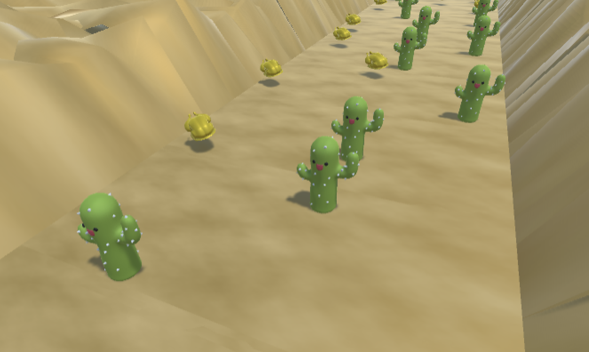

# Procedural Generation

Procedural generation is used in placing obstacles and food onto the game area.



## Asset files
> List of exact paths to repective shader asset files
* `/Assets/Scripts/GeneratePlane.cs`: Implementation of procedural generation within `generateObstacles()`

## Attributes


Attributes to set the probabilities of obstacles and food to be generated

## Breakdown

### Generating Objects
To determine where objects (obstacle or food) are generated, we iterate through every single point within each plane and determine whether an object will be spawned at that point. Determining whether objects are spawned is done by testing a randomly generated number against a predefined probability of getting an obstacle, named `obstacleChance`. An object will be generated if the randomly generated number is smaller than `obstacleChance`. 

```cs
if (Random.value < obstacleChance)
{
    // generate object
}
```

### Choosing food or obstacles
We need to determine whether the spawned object is an obstacle or a food. To do this, we compare yet another randomly generated number against our predefined probability of getting a food, named `foodChance`. A food will be generated if the number is smaller than `foodChance`, otherwise an obstacle is generated.

```cs
if (Random.value < foodChance)
{
    // generate food
}
else
{
    // generate obstacle object
}
```

### Sensible layout
One consideration that we had is that objects generated can't be too close so as to they a) overlap with each other, and b) do not give a path for the player to pass through at all. We do this by adding all our generated objects to a list, then whenever we want to generate an obstacle, we check whether there are any other obstacles within a set radius of this new obstacle. If there is at least one other obstacle within this radius, then the obstacle will not be spawned. This way, we are able to have a procedurally generated game map while ensuring that at any point in the game the player will at least still have a way through.

```cs
foreach(Obstacle obs in obstacleList)
{
    if(inRadius(obs.position, radius, new Vector3(x, 0, z)))
    {
        isValidPos = false;
        break;
    }
}

if (isValidPos)
{
    // generate object
}
```

With this adjustment, we noticed that there is a heavy bias for object spawning at the top left of each plane. This is because the generating objects start from top left of the plane and hence the top left does not have the limitation of needing to check for other obstacles being around it (as there are no obstacles spawned yet). To mitigate this, we simply add a multiplier to `obstacleChance` that increases as we go through each point in the plane, making the top left less likely to have obstacles spawned, and the bottom right more likely to have obstacles.

```cs
var count = 0;

// For every point in the plane
count += 1;
if (Random.value < count / 190f * obstacleChance)
{
    // generate object
}
```

