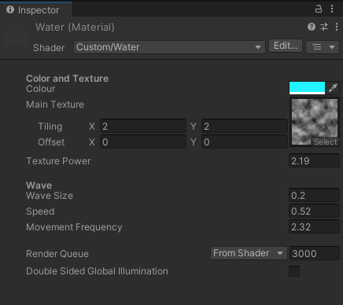
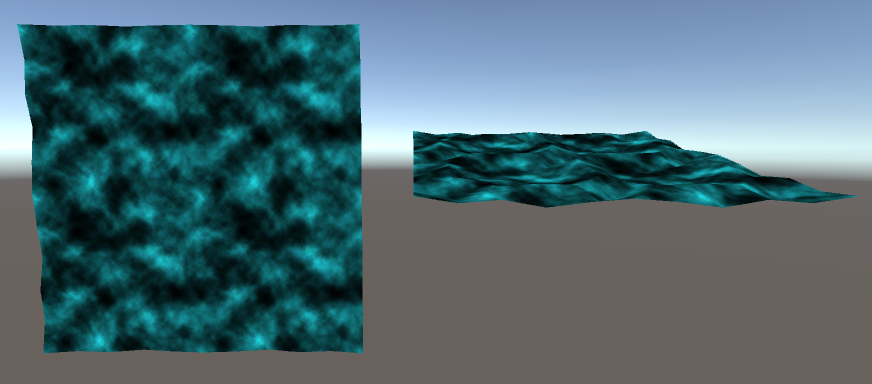

# Water Shader
> [🏠 README.md](../../README.md) | [⬅️ Lava Shader Report](../lava-shader/lava-shader.md) | [➡️ Procedural Generation Report](../procedural-generation/procedural-generation.md)


> Water shader being applied onto 2 planes

The other HLSL/CG shader that we would like to be marked on is the water shader. This shader is used as part of the plane prefab for one of the levels in the game: the water level.


> Water shader being used for the ground planes of the water level

## Table of Contents
- [Water Shader](#water-shader)
  - [Table of Contents](#table-of-contents)
  - [Asset Files](#asset-files)
  - [Attributes](#attributes)
  - [Breakdown](#breakdown)
    - [Tags and SubShader Properties](#tags-and-subshader-properties)
    - [Vertex Shader](#vertex-shader)
    - [Fragment Shader](#fragment-shader)

## Asset Files
> List of exact paths to respective shader asset files
* `./Assets/Shaders/Water.shader` The shader code, written in HLSL
* `./Assets/Shaders/Noise.png` Main texture used for overlay colour
* `./Assets/Materials/Water.mat` Material that utilises the water shader (this material is used for the planes of the water level)

## Attributes

* The Colour and Texture Attributes are mainly for the fragment/vertex shader
* While the Wave Attributes are for the vertex shader

## Breakdown
* This shader implements botj the `vert()` and `frag()` functions
  * The Vertex Shader determines the porition of the vertices and is used to create the wave movement
  * the pixel/fragment shader determines the colour and transparency of each pixel

### Tags and SubShader Properties
```c
...
SubShader
{
    Tags { 
        "Queue" = "Transparent" //change queue to transparent
        "RenderType" = "Transparent"
    }
    // display destination color without modify the source color
    Blend SrcAlpha OneMinusSrcAlpha
    // ZWrite Off is for drawing semitransparent effect
    ZWrite Off
    // Disable Culling, to show all faces of the object
    Cull Off
...
```
* `Blend SrcAlpha OneMinusSrcAlpha` is particularly important for this shader is we wanted the water to have be transparent. Without this, the destination colour usually starts off as (0f, 0f, 0f, 0f), which is black, which is not what we want. We want this shader to add to the current source colour, which is what this line does.
* Wihout theese properties, the areas that are supposed to be transparent will be rendered out as black like so:
  
  > Image of Shader without subshader properties

### Vertex Shader

```c
// Implementing Vertex Shader
vertOut vert( vertIn v)
{
  vertOut o;

  // Create Wave Rippling Effect through y displacement
  half4 offsetVert = (v.vertex.x * v.vertex.x) + (v.vertex.z * v.vertex.z);
  half4 yDisplacement = _Scale * sin(_Time.w * _Speed + offsetVert * _Frequency);

  v.vertex.y += yDisplacement;

  o.vertex = UnityObjectToClipPos(v.vertex);
  o.uv = TRANSFORM_TEX(v.uv, _MainTex);
  return o;
}
```

### Fragment Shader
```c
// Implementing Pixel/Fragment Shader
float4 frag(vertOut v):SV_TARGET
{
  // Make texture move over time
  float2 uv = v.uv + _Frequency * _Time.x;
  half4 tex = tex2D(_MainTex, uv);
  // Enhance the contrast of the texture
  tex = pow(tex, _TexPow);

  // Colouring texture
  half4 finalColour = tex * _Colour;
  // Setting transparency to be the same as texture
  finalColour.a = tex2D(_MainTex, uv);

  return finalColour;
}
```
* The fragment shader essentially colours the texture with whatever colour is selected by the user and leaves all of the other pixels untouched; which, due to the [Tags and SubShader Properties](#tags-and-subshader-properties), will be render the original pixel colour (ie. make the material look transparent).

> Written and Implemented by Chuah Xin Yu
